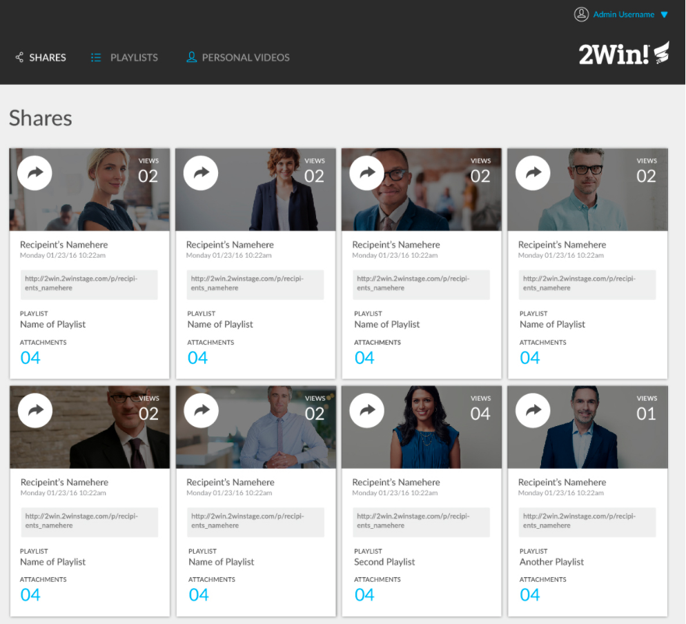
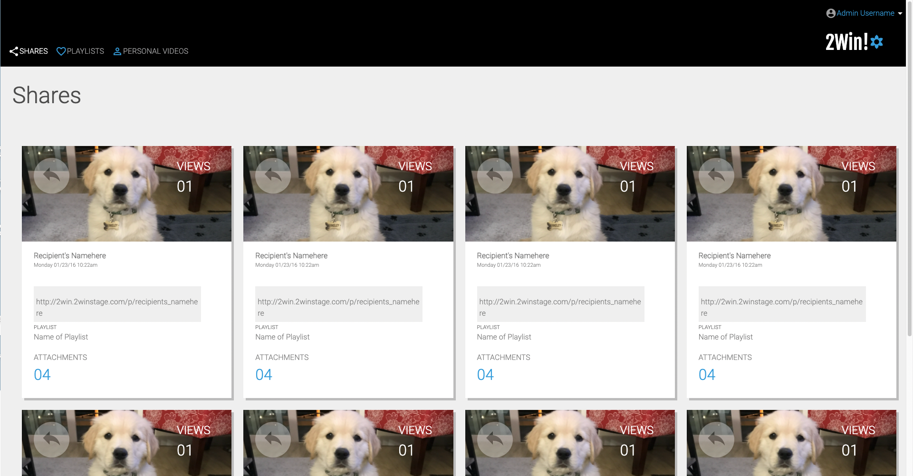
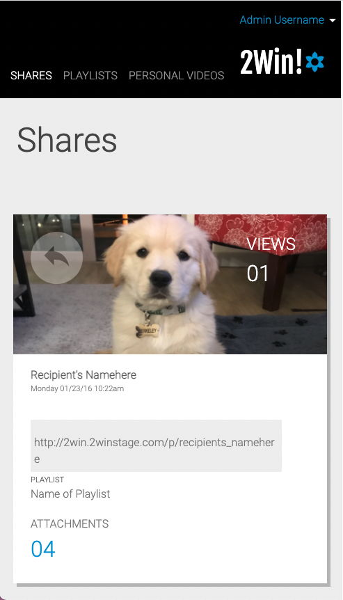

# Static-comp

The Static comp challenge was to re-create a webpage based off off the provided static comp using html and css. The site must be responsive over various screen sizes. I used similar colors/icons, but I changed the image for each card.

## Overview

Deployed Page(https://sydnerd.github.io/static-comp/)

## Original comp

## My design
Large Desktop View

Mobile View

## Technologies Used
- HTML
- CSS

## Contributor

This application was written by [Sydney Bear](https://github.com/sydnerd) Mod 2 frontend engineering student at [Turing School of Software & Design](https://turing.edu/).
